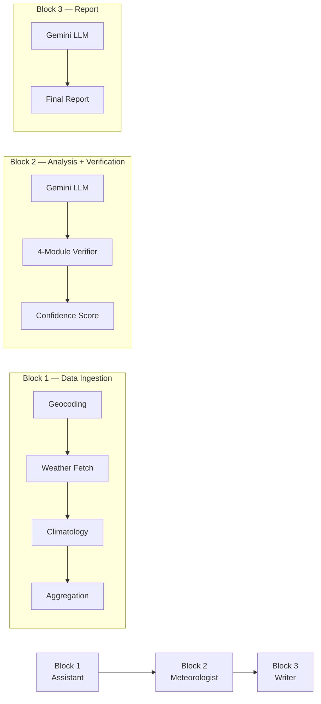
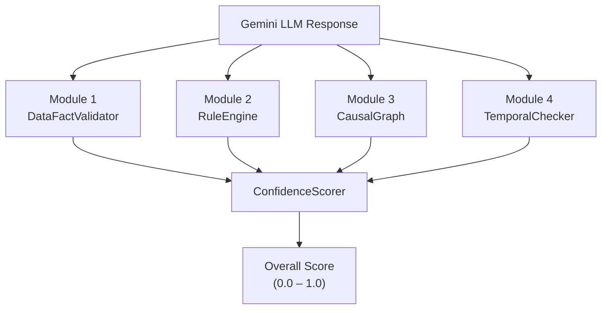
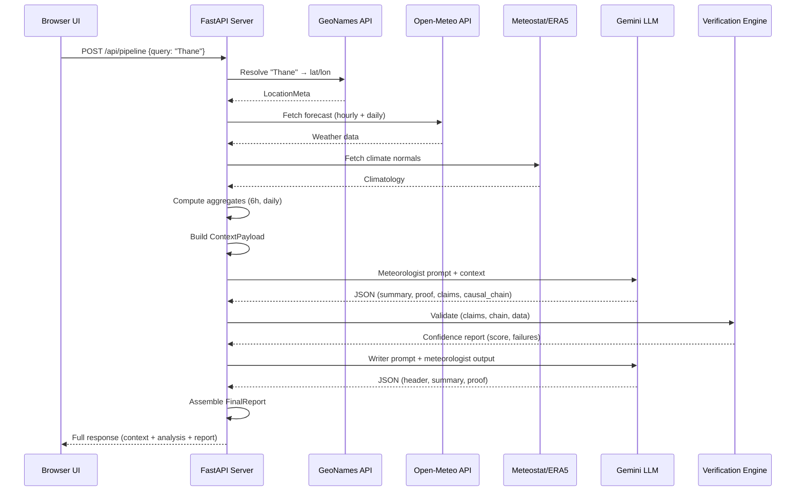

# Hierarchical AI Meteorologist — Project Documentation

## Overview

The **Hierarchical AI Meteorologist** is a full-stack weather analysis and report generation system. It fetches real-time and forecast weather data, feeds it through a Gemini LLM acting as an expert meteorologist, **verifies** the LLM's output against physical rules and observed data, and produces a polished weather report — all served via a FastAPI backend with a single-page HTML frontend.

The key innovation is the **4-module verification engine** that catches LLM hallucinations before they reach the user. The LLM doesn't just generate text — it also produces structured claims, a causal chain, and keywords, all of which are cross-validated against the actual data.

---

## Architecture — The 3-Block Pipeline



| Block | Responsibility | Key Output |
|-------|---------------|------------|
| **Block 1 — Assistant** | Resolve location, fetch weather data, compute aggregates, build structured context | `ContextPayload` |
| **Block 2 — Meteorologist** | LLM generates weather analysis; verification engine validates it | `MeteorologistOutput` + confidence report |
| **Block 3 — Writer** | LLM adapts the analysis into a reader-friendly report | `FinalReport` |

---

## Project File Structure

```
Hierarchical_ai_meteorologist_/
├── app/
│   ├── main.py                  # FastAPI app, routes, pipeline orchestration
│   ├── config.py                # Settings (API keys, model name, thresholds)
│   ├── schemas.py               # All Pydantic data models
│   ├── validation.py            # Input validation helpers
│   ├── cache_store.py           # JSON file-based caching system
│   ├── degradation.py           # Degradation code enums
│   ├── jsonutil.py              # JSON hashing utilities
│   │
│   ├── assistant/               # Block 1 — Data Ingestion
│   │   ├── geocoding.py         # Location resolution (GeoNames + Wikipedia)
│   │   ├── openmeteo.py         # Weather data fetching (Open-Meteo API)
│   │   ├── climatology.py       # Climate normals (Meteostat + ERA5 fallback)
│   │   ├── aggregation.py       # 6-hour and daily aggregate computation
│   │   ├── categories.py        # Weather code → category mapping
│   │   ├── context_builder.py   # Orchestrates Block 1 pipeline
│   │   ├── nws.py               # NWS Area Forecast Discussion (US only)
│   │   └── retry.py             # HTTP retry utility
│   │
│   ├── llm/                     # LLM Integration
│   │   ├── gemini_client.py     # Gemini API wrapper (send/receive/parse)
│   │   ├── meteorologist.py     # Block 2 orchestration + verification loop
│   │   ├── writer.py            # Block 3 orchestration
│   │   └── prompts.py           # Prompt templates for both LLM stages
│   │
│   └── verification/            # 4-Module Verification Engine
│       ├── data_validator.py    # Module 1: Fact-checks claims against data
│       ├── evaluator.py         # Tracks precision/recall metrics and logs history
│       ├── rule_engine.py       # Module 2: Meteorological rule validation
│       ├── causal_graph.py      # Module 3: Causal chain graph validation
│       ├── temporal_checker.py  # Module 4: Cross-scale consistency
│       ├── confidence_scorer.py # Aggregates all 4 modules into one score
│       ├── met_rules.yaml       # 16 meteorological rules database
│       ├── thresholds.yaml      # Threshold configs for fact-checking
│       ├── verification_weights.yaml  # Component weight configs
│       └── utils.py             # UTC normalization utilities
│
├── ui/
│   └── index.html               # Single-page frontend (HTML/CSS/JS)
│
├── .env                         # Environment variables (API keys)
├── requirements.txt             # Python dependencies
└── README.md                    # Project README
```

---

## Important Files — Detailed Breakdown

### 1. [main.py](file:///c:/Users/Krish Vinod/Hierarchical_ai_meteorologist_/app/main.py) — FastAPI Application Entry Point

This is the heart of the server. It defines the FastAPI app and all API routes.

**API Endpoints:**

| Endpoint | Method | Description |
|----------|--------|-------------|
| `/` | GET | Serves the demo UI (`ui/index.html`) |
| `/health` | GET | Health check |
| `/api/pipeline` | POST | **Full pipeline**: Assistant → Meteorologist → Writer in one request |
| `/context` | POST | Block 1 only: resolve location + fetch data |
| `/analysis` | POST | Block 2 only: run meteorologist on pre-built context |
| `/report` | POST | Block 2 + 3: meteorologist + writer on pre-built context |

The main pipeline endpoint (`/api/pipeline`) accepts a `FullPipelineRequest` with fields like `query` (city name), `latitude`, `longitude`, `tone`, `length`, `domain`, and orchestrates the entire chain. It returns the raw context, meteorologist output, final report, and degradation codes.

**Security**: The `redact_secrets()` function scrubs API keys from error messages before returning them to the client.

---

### 2. [config.py](file:///c:/Users/Krish Vinod/Hierarchical_ai_meteorologist_/app/config.py) — Settings & Configuration

Uses `pydantic-settings` to load configuration from `.env` files. Key settings:

| Setting | Default | Purpose |
|---------|---------|---------|
| `gemini_api_key` | `""` | Google Gemini API key |
| `gemini_model` | `"gemini-3-flash-preview"` | Which Gemini model to use |
| `geonames_username` | `"demo"` | GeoNames geocoding API username |
| `verification_threshold` | `0.55` | Minimum verification score to pass |
| `cache_dir` | `.cache` | Where cached responses are stored |
| `meteostat_normals_start_year` | `1991` | Climate normals start year |
| `meteostat_normals_end_year` | `2020` | Climate normals end year |

---

### 3. [schemas.py](file:///c:/Users/Krish Vinod/Hierarchical_ai_meteorologist_/app/schemas.py) — Pydantic Data Models

Defines every data structure used across the pipeline. Key models:

- **`LocationMeta`** — City, country, lat/lon, elevation, Wikipedia summary
- **`HourlyRow`** — Single hourly weather observation (temp, humidity, wind, pressure, etc.)
- **`SixHourAggregateRow`** — 6-hour aggregate window (means, sums)
- **`DailyAggregateRow`** — Daily aggregate
- **`ClimatologyBlock`** — Monthly climate normals (Meteostat or ERA5)
- **`ContextPayload`** — The full Block 1 output: location + all data tables + metadata
- **`WeatherClaim`** — A structured, verifiable claim (variable, assertion type, time window, threshold)
- **`MeteorologistOutput`** — Block 2 output: summary, proof, keywords, warnings, claims, causal chain
- **`FinalReport`** — Block 3 output: header, analysis, context echo, frozen context

> [!IMPORTANT]
> `MeteorologistOutput` has **field validators** that handle common LLM quirks:
> - `coerce_to_string` — If the LLM returns `proof` or `summary` as a list, it auto-joins them
> - `truncate_keywords` — If keywords exceed 5, silently truncates to 5

---

### 4. [context_builder.py](file:///c:/Users/Krish Vinod/Hierarchical_ai_meteorologist_/app/assistant/context_builder.py) — Block 1 Orchestrator

The `run_assistant_pipeline()` function orchestrates Block 1:

```
1. resolve_location()     → GeoNames geocoding + Wikipedia summary
2. maybe_attach_afd()     → NWS Area Forecast Discussion (US locations only)
3. fetch_climatology()    → Meteostat normals → ERA5 fallback if empty
4. fetch_forecast()       → Open-Meteo current + hourly + daily forecast
5. aggregate_six_hour()   → Compute 6-hour aggregates from hourly
6. aggregate_daily()      → Compute daily aggregates from hourly
7. merge_daily_tables()   → Merge hourly-derived daily with Open-Meteo daily
8. trim_payload_for_mode() → Remove hourly data if lead time > 7 days
```

**Smart context mode**: If the forecast lead time is under 7 days, all hourly data is included. Beyond that, only aggregates are sent to save tokens.

**Caching**: Context payloads are hashed and cached to `.cache/` as JSON files. Repeated queries for the same location skip all API calls.

---

### 5. [gemini_client.py](file:///c:/Users/Krish Vinod/Hierarchical_ai_meteorologist_/app/llm/gemini_client.py) — Gemini API Wrapper

Two key functions:

- **`generate_json_text(prompt, temperature)`** — Sends a prompt to Gemini with `response_mime_type="application/json"` and `max_output_tokens=4096`. Includes retry logic, detailed logging with call counts, timing, and token usage estimates.
- **`parse_json_object(text)`** — Strips markdown fences (` ```json `) and parses JSON. Handles LLM responses that wrap JSON in code blocks.

> [!NOTE]
> The `max_output_tokens` is set to **4096** to stay within Gemini free tier limits. The prompt instructs the LLM to keep responses under 3000 tokens.

---

### 6. [meteorologist.py](file:///c:/Users/Krish Vinod/Hierarchical_ai_meteorologist_/app/llm/meteorologist.py) — Block 2 Orchestrator

The most complex orchestration file. `run_meteorologist()` does:

1. **Build prompt** from context payload
2. **Call Gemini** for meteorological analysis
3. **Parse JSON response** into structured data
4. **Run all 4 verification modules** on the parsed output:
   - DataFactValidator — fact-check every claim against real data
   - MeteorologicalRuleEngine — check if/else meteorological rules fire correctly
   - CausalGraph — validate causal chain transitions
   - TemporalConsistencyChecker — check cross-scale directional coherence
5. **Compute confidence score** via ConfidenceScorer
6. **Log results** including score and failures
7. **Attach** the confidence report to the output
8. **Cache** the result

The system currently runs **1 attempt** (no retries) to minimize API usage. The retry infrastructure exists and can be enabled by setting `max_retry_attempts > 0`, which re-prompts the LLM with failure feedback.

---

### 7. [prompts.py](file:///c:/Users/Krish Vinod/Hierarchical_ai_meteorologist_/app/llm/prompts.py) — LLM Prompt Templates

Two prompt builders:

**`meteorologist_prompt(ctx)`**:
- Dumps the entire context payload as compact JSON (no indentation)
- Trims hourly data to last 24 entries to save tokens
- Instructs the LLM to return: summary (1-2 paragraphs), proof (6-8 bullets), keywords (3-5), claims (max 8), causal chain (4-8 nodes from a fixed vocabulary), and reasoning flags
- Explicitly says "Keep response under 3000 tokens"

**`writer_prompt(meteorologist, params, ctx)`**:
- Takes the meteorologist output and adapts it for the target audience
- Respects tone (technical/conversational/official), length (short/medium/long), and domain (energy/agriculture/general public/etc.)
- Produces header, adapted summary, and proof

---

### 8. [writer.py](file:///c:/Users/Krish Vinod/Hierarchical_ai_meteorologist_/app/llm/writer.py) — Block 3 Orchestrator

Simpler than Block 2. `run_writer()`:
1. Calls Gemini with the writer prompt
2. Parses the response into `WriterLLMOutput` (header + summary + proof)
3. Assembles the `FinalReport` by merging the writer's adapted text with the meteorologist's keywords and warnings
4. Builds a `ReportContextEcho` so the final report includes the data context for reproducibility
5. Caches the result

---

## The 4-Module Verification Engine

This is the core differentiator of the project. Every LLM response is validated by four independent modules before being accepted.



### Module 1: [data_validator.py](file:///c:/Users/Krish Vinod/Hierarchical_ai_meteorologist_/app/verification/data_validator.py) — Fact-Checking Against Raw Data

**Purpose**: For each `WeatherClaim` the LLM produces, this module checks if the claim is actually supported by the real weather data in the DataFrames.

**How it works**:
1. Maps each claim's `variable` and `data_scale` to the correct DataFrame column (e.g., `"temperature"` at `"hourly"` scale → column `t_c`)
2. Filters the DataFrame to the claim's time window (`window_start_utc` to `window_end_utc`)
3. Validates the claim's assertion:
   - **Trends** (increasing/decreasing): Computes linear regression slope + monotonic step ratio. Passes if slope matches direction AND ≥50% of consecutive steps match.
   - **Thresholds** (e.g., `> 25.0`): Counts how many observations meet the condition. Passes if ≥25% of the window satisfies it.
   - **Categories** (e.g., `"thunderstorm"`): Substring matching against categorical columns.
   - **Ranges** (e.g., `1007 to 1016`): Counts values within range.

**Key config**: [thresholds.yaml](file:///c:/Users/Krish Vinod/Hierarchical_ai_meteorologist_/app/verification/thresholds.yaml) — maps category names like "strong wind" to numeric ranges.

---

### Module 2: [rule_engine.py](file:///c:/Users/Krish Vinod/Hierarchical_ai_meteorologist_/app/verification/rule_engine.py) — Meteorological Rule Validation

**Purpose**: Checks if known meteorological cause-effect relationships hold in the LLM's output. For example: "If pressure drops ≥3 hPa, wind should reach ≥8 m/s."

**How it works**:
1. Loads 16 rules from [met_rules.yaml](file:///c:/Users/Krish Vinod/Hierarchical_ai_meteorologist_/app/verification/met_rules.yaml)
2. For each rule, checks two independent firing paths:
   - **Claims path**: Checks if all antecedent variables appear in the claims list with matching direction AND magnitude. Then checks if the consequent claim appears within the expected lag window.
   - **Chain path**: Checks if the antecedent events appear in the causal chain. **Only fires for categorical rules** (e.g., `weather_category == "thunderstorm"`) — numeric rules are excluded via a magnitude guard to prevent false firings.
3. A rule "fires" if the antecedent is matched. If fired but the consequent is missing or contradicted → **violation** (penalized).

**Key design decisions**:
- **Magnitude guard** (lines 363-376): Chain-based firing only activates for rules with string thresholds. This prevents rules like RULE_001 (pressure drop → wind) from firing via chain when the actual pressure drop is too small.
- **Time overlap validation**: Antecedent claims must overlap temporally to count as simultaneous triggers (important for multi-antecedent rules like RULE_016).
- **Margin system**: Each variable has a tolerance margin (e.g., ±1°C for temperature) to account for measurement uncertainty.

**The 16 Rules** (from [met_rules.yaml](file:///c:/Users/Krish Vinod/Hierarchical_ai_meteorologist_/app/verification/met_rules.yaml)):

| Rule | Name | Antecedent → Consequent | Status / Config |
|------|------|-------------------------|-----------------|
| RULE_001 | Baric Wind Rule | Pressure drop ≤ −3 hPa → Wind ≥ 8 m/s | Active |
| RULE_002 | Saturated Air Precipitation | Humidity > 90% → Precipitation > 0 | Active |
| RULE_003 | Thermal Low Development | Temperature > 35°C → Pressure drop < −1.5 hPa | Active |
| RULE_004 | Convective Storm Risk | Thunderstorm → Precipitation ≥ 7.6 mm | Disabled (`confidence_weight: 0.0`) |
| RULE_005 | Cold Frontal Passage | Temp change < −3°C → Pressure rise > 1.5 hPa | Active |
| RULE_006 | Sea Breeze Initiation | Temperature > 28°C → Wind > 4 m/s | Active |
| RULE_007 | Cyclone Wind Risk | Pressure drop ≤ −6 hPa → Wind ≥ 17.2 m/s | Active |
| RULE_008 | Dry Air Rain Suppression | Humidity < 30% → Precipitation = 0 | Active |
| RULE_009 | Warm Frontal Advection | Temp change > 3°C → Pressure drop < −1.5 hPa | Active |
| RULE_010 | Diurnal Radiational Cooling | Humidity < 40% → Temp change < −4°C | Active |
| RULE_011 | Radiation Fog Formation | Humidity ≥ 98% → Visibility < 1000 m | Active |
| RULE_012 | Rainfall Saturation | Precipitation > 2.5 mm → Humidity > 85% | Commented Out |
| RULE_013 | Evaporative Cooling | Precipitation > 5 mm → Temp change < −2°C | Commented Out |
| RULE_014 | Heavy Rain Wind Gusts | Precipitation > 10 mm → Wind gust ≥ 15 m/s | Commented Out |
| RULE_015 | High Pressure Wind Suppression | Pressure > 1025 hPa → Wind ≤ 3.4 m/s | Active |
| RULE_016 | Fog Persistence | Humidity > 90% + Stable pressure + Light winds → Fog persists | Active |

---

### Module 3: [causal_graph.py](file:///c:/Users/Krish Vinod/Hierarchical_ai_meteorologist_/app/verification/causal_graph.py) — Causal Chain Validation

**Purpose**: Validates that the LLM's causal chain (e.g., `["pressure_drop", "wind_increase", "rainfall"]`) represents physically plausible transitions.

**How it works**:
1. Builds a directed graph (`networkx.DiGraph`) from the 16 rules + 14 system-injected links (e.g., `high_humidity → low_visibility`)
2. Normalizes all node names via `_normalize_node()` (handles synonyms like `"clearing" → "no_rain"`, `"humidity_rise" → "high_humidity"`)
3. For each adjacent pair in the causal chain:
   - **Forbidden edge check**: If the pair is in `invalid_edges` (e.g., `dry_air → rainfall`), it's flagged and the **entire causal score is zeroed**
   - **Direct edge check**: If a direct edge exists in the graph, use its confidence weight
   - **Path check**: If no direct edge exists but a path does, compute cumulative confidence with a path-length penalty
   - **No path**: Flagged as an invalid (unlinked) transition
4. Reports missing intermediate nodes (e.g., if the chain jumps from `pressure_drop` to `rainfall` without `high_humidity`)

**Forbidden edges** (physically impossible):
- `dry_air → rainfall` — Can't rain from dry air
- `dry_air → fog_formation` — Can't form fog in dry conditions
- `dry_air → fog_persistence` — Can't sustain fog in dry conditions
- `cooling → extreme_heat` — Contradictory
- `clearing → rainfall` — Contradictory

> [!WARNING]
> The `_normalize_node()` method uses **keyword substring matching**. The order of checks matters — `"no_rain"` must be checked **before** `"rain"` because `"rain"` is a substring of `"no_rain"`. This was a bug that was fixed.

---

### Module 4: [temporal_checker.py](file:///c:/Users/Krish Vinod/Hierarchical_ai_meteorologist_/app/verification/temporal_checker.py) — Cross-Scale Consistency

**Purpose**: Detects directional contradictions across time scales. For example, a daily claim saying "temperature increasing" shouldn't coexist with an hourly claim saying "temperature decreasing" in the same time window.

**How it works**:
1. Separates claims by scale: daily, 6-hour, hourly
2. For each pair of claims on the same variable at different scales:
   - Checks if their time windows overlap
   - Extracts directional intent (up/down/neutral) from assertion type and threshold text
   - If one says "up" and the other says "down" → **high-severity contradiction**
3. Returns consistency score: `1.0 - (penalties / checks_count)`

---

### [confidence_scorer.py](file:///c:/Users/Krish Vinod/Hierarchical_ai_meteorologist_/app/verification/confidence_scorer.py) — Aggregation Into Final Score

**Purpose**: Combines all 4 module scores into one overall confidence score using a **weighted harmonic mean**.

**Default weights** (configurable in [verification_weights.yaml](file:///c:/Users/Krish Vinod/Hierarchical_ai_meteorologist_/app/verification/verification_weights.yaml)):

| Component | Weight | What it scores |
|-----------|--------|---------------|
| `data_fact` | 0.35 | % of claims that pass fact-checking |
| `met_rule` | 0.10 | Rule consistency (violations reduce score) |
| `causal_graph` | 0.20 | Causal chain validity (0.0 if forbidden edge) |
| `temporal_consistency` | 0.20 | Cross-scale directional coherence |

> [!IMPORTANT]
> **Harmonic mean zero-guard**: The three core physical check modules (`data_fact`, `causal_graph`, and `temporal_consistency`) are evaluated via a weighted harmonic mean. If **any of these three components is 0.0**, the overall score is **strictly 0.0**. The `met_rule` component is added **arithmetically** after this step and does not trigger the zero-guard.

**Severity levels**:
- **High**: Rule violations, forbidden causal transitions, cross-scale contradictions
- **Medium**: Failed fact-checks
- **Low**: Missing intermediate causal chain nodes

The minimum score required to pass is controlled by `verification_threshold` in config (default: **0.55**).

---

## Data Flow — End to End



---

## Caching System

The project uses a simple **file-based JSON cache** ([cache_store.py](file:///c:/Users/Krish Vinod/Hierarchical_ai_meteorologist_/app/cache_store.py)):

- Cached under `.cache/{namespace}/{sha256_hash}.json`
- Three cache namespaces: `context`, `meteorologist`, `report`
- Cache keys are SHA-256 hashes of the input payload (deterministic)
- Degradation codes track cache hits: `CACHE_HIT_CONTEXT`, `CACHE_HIT_METEOROLOGIST`, `CACHE_HIT_REPORT`
- Cache can be bypassed per-request with `use_cache: false`

---

## Environment Variables (`.env`)

```env
GEMINI_API_KEY=your_key_here
GEMINI_MODEL=gemini-3-flash-preview
GEONAMES_USERNAME=your_username
CDS_URL=                          # Optional, for ERA5 direct access
CDS_KEY=                          # Optional
```

---

## Running the Project

```bash
# 1. Activate virtual environment
venv\Scripts\Activate.ps1

# 2. Install dependencies
pip install -r requirements.txt

# 3. Start the server (with hot reload)
python -m uvicorn app.main:app --reload

# Server runs at http://127.0.0.1:8000
# UI available at http://127.0.0.1:8000/
```

---

## Key Design Decisions & Gotchas

1. **Token budget**: The system is designed for the Gemini free tier. The prompt compacts the JSON payload (`separators=(',',':')`) and trims hourly data to 24 rows max. Output is capped at 4096 tokens.

2. **Single-attempt by default**: `max_retry_attempts = 0` means only 1 LLM call. The retry infrastructure exists but is disabled to save API quota. Set it to `1` or `2` for production use.

3. **Causal chain vocabulary is fixed**: The LLM must choose from exactly 16 node names. Any other phrase gets normalized by `_normalize_node()` using keyword matching, which can cause surprises if the matching order is wrong.

4. **Verification score of 0.0 is fatal**: Due to the harmonic mean, a single forbidden causal edge or a zero on any module kills the entire score. This is by design — it's better to fail loudly than pass a hallucinated forecast.

5. **Wikipedia is flaky**: The Wikipedia API often returns 403 Forbidden. The system degrades gracefully — it sets `WIKIPEDIA_UNAVAILABLE` but continues without the summary.

6. **NWS is US-only**: The Area Forecast Discussion attachment only works for US locations. Non-US locations simply skip this step.
